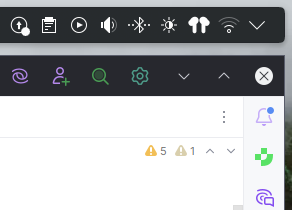

  

<h1 align="center">Earbud compagnion <i>- a plasma widget</i></h1>

## Description

Very simple plugin that show if a earplug is connected and show relevant information via the popup.

### main feature

- Custom color for the icon and the dot
- Optional dot
- Can be "show if relevant" via the systemtray (the intended usage)
- Use `org.kde.bluezqt` to fetch the data and update status

## Installation

### Plasma 6
- Download via [the KDE store](https://www.pling.com/p/2299736/)
- Install it via the "Get new plasma widgets"
- Download the last release and extract it and place the folder into `~/.local/share/plasma/plasmoids/`

## Code of conduct, license, authors, changelog, contributing

See the following file :
- [code of conduct](CODE_OF_CONDUCT.md)
- [license](LICENSE)
- [contributing](CONTRIBUTING.md)
- [security](SECURITY.md)

## Want to participate? Have a bug or a request feature?

Do not hesitate to open a pr or an issue. I reply when I can.

## Want to support my work?

- [Give a star on github](https://github.com/bouteillerAlan/earbud-companion)
- [Give me a tips](https://github.com/sponsors/bouteillerAlan)
- [Add a rating and a comment on Pling](https://www.pling.com/p/#/)
- [Become a fan on Pling](https://www.pling.com/p/#/)
- Or just participate to the developement :D

### Thanks !
